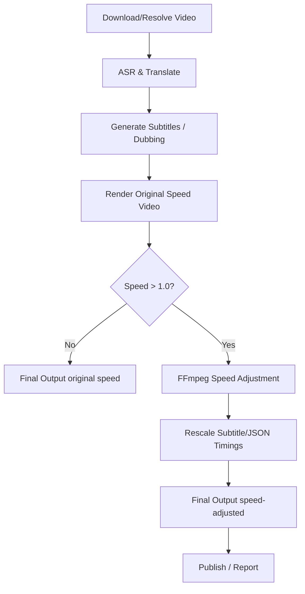

# Design: Output Playback Speed Feature

This document details the software design for integrating playback speed adjustment at the end of the video-dubbing pipeline.

## 1. Architectural Overview
The playback speed feature is implemented as a standalone post-processing module. The core translation and dubbing pipelines continue to operate in original timing. Once the final output video (`subtitled_video.mp4` or `dubbed_video.mp4`) is rendered, the new module accelerates the media and updates corresponding subtitle files.



## 2. Core Module: `src/output_speed.py`
A new file `src/output_speed.py` will be created with the following functions:

### 2.1 Validation
```python
def validate_output_speed(speed: float) -> float:
    # Ensures speed is in [1.0, 1.1, 1.2, 1.3]
    # Raises ValueError if invalid.
```

### 2.2 Suffix Generation
```python
def build_speed_suffix(speed: float) -> str:
    # Formats speed as string suffix e.g., "_1.2x"
    # Returns empty string if speed == 1.0
```

### 2.3 FFmpeg Video & Audio Acceleration
Uses a subprocess command to run FFmpeg with the `setpts` (video) and `atempo` (audio) filters.
- **Command**:
  `ffmpeg -y -i <input> -filter_complex "[0:v]setpts=PTS/<speed>[v];[0:a]atempo=<speed>[a]" -map "[v]" -map "[a]" <output>`
- **No-Audio Safety**: Checks if the input video has an audio stream via `ffprobe` or a fallback check. If no audio stream is detected:
  `ffmpeg -y -i <input> -filter_complex "[0:v]setpts=PTS/<speed>[v]" -map "[v]" <output>`

### 2.4 Subtitle Adjustments
Timestamps are rescaled by dividing by the speed factor.
- **SRT File Processing**: Parses each subtitle block, converts `00:00:10,000` to total seconds, divides by `speed`, and formats back to `00:00:08,333`.
- **ASS File Processing**: Reads the ASS file line-by-line, identifies lines starting with `Dialogue:`, parses the start and end timestamp fields, divides by `speed`, and writes back.
- **JSON Transcript Processing**: Loads `transcript_vi.json`, divides fields `start`, `end`, and `duration` of each segment by `speed`, and saves the modified JSON structure.

## 3. Integration Points
- **`config.py`**:
  - Adds configuration fields with defaults from environment variables.
- **`pipeline_vi.py`**:
  - Adds CLI parameter `--output-speed`.
  - At the end of `run_pipeline_vi` (after rendering `subtitled_video.mp4` / `dubbed_video.mp4`), if speed > 1.0, calls `apply_playback_speed_to_video` and timing-adjusting methods.
  - Updates the `report.json` and returns the speed-adjusted video path as the primary video for publishing and reporting.
- **`src/batch_runner.py` / `tools/batch_runner.py`**:
  - Adds CLI argument `--output-speed`.
  - Pass the speed parameter down to each single-video job payload.
  - Writes speed details to the final batch report files.
- **`web_server.py`**:
  - Incorporates `output_playback_speed` into `PipelineRequest` and `BatchPipelineRequest` Pydantic models.
  - Updates API endpoints to pass speed selections to pipeline execution methods.
- **`static/index.html`**:
  - Adds a speed dropdown UI element within "Cấu hình Dubbing & Phụ đề".
  - Includes speed selection in single & batch execution payloads.
