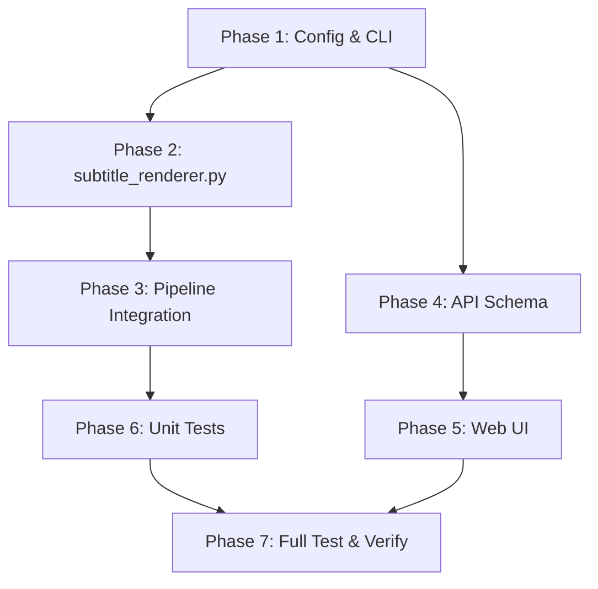

# TASK: Che phụ đề gốc & Render phụ đề Việt có nền

> **Ref**: [requirement.md](file:///d:/MMO/Auto-Translade-video/Task/xoanenchutrung/requirement.md)

---

## Phase 1: Thêm Config & CLI Parameters

- [ ] **1.1** Thêm biến config subtitle vào [config.py](file:///d:/MMO/Auto-Translade-video/config.py)
  ```python
  # Subtitle Cover & Render Config
  SUBTITLE_MASK_Y_PERCENT = float(os.getenv("SUBTITLE_MASK_Y_PERCENT", "0.82"))
  SUBTITLE_MASK_HEIGHT_PERCENT = float(os.getenv("SUBTITLE_MASK_HEIGHT_PERCENT", "0.18"))
  SUBTITLE_MASK_OPACITY = float(os.getenv("SUBTITLE_MASK_OPACITY", "0.55"))
  SUBTITLE_FONT_NAME = os.getenv("SUBTITLE_FONT_NAME", "Arial")
  SUBTITLE_FONT_SIZE = int(os.getenv("SUBTITLE_FONT_SIZE", "48"))
  SUBTITLE_OUTLINE_SIZE = int(os.getenv("SUBTITLE_OUTLINE_SIZE", "2"))
  SUBTITLE_SHADOW_SIZE = int(os.getenv("SUBTITLE_SHADOW_SIZE", "1"))
  SUBTITLE_BOX_OPACITY = float(os.getenv("SUBTITLE_BOX_OPACITY", "0.6"))
  SUBTITLE_MARGIN_BOTTOM = int(os.getenv("SUBTITLE_MARGIN_BOTTOM", "60"))
  SUBTITLE_MAX_CHARS_PER_LINE = int(os.getenv("SUBTITLE_MAX_CHARS_PER_LINE", "24"))
  ```

- [ ] **1.2** Thêm CLI args vào [pipeline_vi.py](file:///d:/MMO/Auto-Translade-video/pipeline_vi.py) hàm `parse_args()`
  - `--cover-original-subtitles` (store_true, default False)
  - `--subtitle-style` (choices=["boxed", "plain"], default "plain")

- [ ] **1.3** Thêm params vào hàm `run_pipeline_vi()`
  - `cover_original_subtitles: bool = False`
  - `subtitle_style: str = "plain"`

- [ ] **1.4** Pass CLI args xuống `run_pipeline_vi()` trong `main()`

---

## Phase 2: Tạo Module `src/subtitle_renderer.py`

- [ ] **2.1** Tạo file mới [src/subtitle_renderer.py](file:///d:/MMO/Auto-Translade-video/src/subtitle_renderer.py)

- [ ] **2.2** Implement function `_resolve_subtitle_text(segment)`
  - Duyệt qua field priority: `subtitle_vi > final_dub_vi > dub_vi > text_vi > literal_vi`
  - Return text tìm được hoặc `""` nếu không có

- [ ] **2.3** Implement function `_wrap_text(text, max_chars_per_line)`
  - Tách text thành tối đa 2 dòng
  - Giữ nguyên dấu tiếng Việt khi tách
  - Dùng `\N` (ASS newline) thay vì `\n`

- [ ] **2.4** Implement function `_format_ass_time(seconds)`
  - Convert float seconds → ASS time format `H:MM:SS.cc` (centiseconds)
  - Ví dụ: `3.5` → `0:00:03.50`

- [ ] **2.5** Implement function `generate_ass_subtitles(segments, output_path, style_config)`
  - Tạo ASS header với `[Script Info]`, `[V4+ Styles]`, `[Events]`
  - Style `plain`: `BorderStyle=1` (outline + shadow), không box
  - Style `boxed`: `BorderStyle=4` (opaque box), `BackColour` có alpha
  - Ghi file với UTF-8 BOM encoding
  - Log: `"Generating ASS subtitles (style=X, segments=N)"`
  - Return đường dẫn file ASS đã tạo

- [ ] **2.6** Implement function `render_video_with_cover(input_video, ass_path, output_path, cover_config)`
  - Xây dựng FFmpeg `-vf` filter chain:
    - Nếu `cover_original_subtitles=True`: `drawbox=...,ass=transcript_vi.ass`
    - Nếu `cover_original_subtitles=False`: `ass=transcript_vi.ass`
  - Audio: `-c:a copy`, fallback → `-c:a aac`
  - Video: `-c:v libx264 -preset veryfast -crf 22`
  - **Quan trọng**: Dùng `ass=` filter (không phải `subtitles=`) vì file ASS cần render đúng style
  - Path ASS cần escape `:` và `\` cho FFmpeg trên Windows
  - Log: `"Applying subtitle cover box: y=X%, h=Y%, opacity=Z"`
  - Log: `"Rendering subtitled video → output.mp4"`
  - Nếu FFmpeg lỗi: raise `RuntimeError` rõ ràng

---

## Phase 3: Tích hợp vào Pipeline (`pipeline_vi.py`)

- [ ] **3.1** Import `generate_ass_subtitles`, `render_video_with_cover` từ `src.subtitle_renderer`

- [ ] **3.2** Cập nhật Step 7 (`subtitle_only` branch) trong `run_pipeline_vi()`:
  ```python
  if mode == "subtitle_only":
      if burn_subtitles:
          # Luôn tạo SRT (cho compatibility)
          generate_srt(...)
          
          # Tạo ASS file
          ass_path = generate_ass_subtitles(segments, ..., style_config)
          
          # Render video (cover + ASS thay vì SRT burn cũ)
          cover_config = {
              "cover_original_subtitles": cover_original_subtitles,
              "mask_y_percent": config.SUBTITLE_MASK_Y_PERCENT,
              "mask_height_percent": config.SUBTITLE_MASK_HEIGHT_PERCENT,
              "mask_opacity": config.SUBTITLE_MASK_OPACITY,
          }
          render_video_with_cover(video_path, ass_path, subtitled_video_path, cover_config)
      else:
          shutil.copy2(video_path, subtitled_video_path)
  ```

- [ ] **3.3** Cập nhật `report` dict:
  - Thêm `"subtitle_burned"`, `"cover_original_subtitles"`, `"subtitle_style"`
  - Thêm `"transcript_vi_ass"` vào `files`

- [ ] **3.4** Kiểm tra: mode `dub_audio` KHÔNG chạy vào bất kỳ code mới nào

---

## Phase 4: Cập nhật API Schema (`web_server.py`)

- [ ] **4.1** Thêm fields vào `PipelineRequest`:
  ```python
  cover_original_subtitles: bool = False
  subtitle_style: str = "plain"
  ```

- [ ] **4.2** Pass params mới vào `run_pipeline_vi()` trong `execute_pipeline()`

---

## Phase 5: Cập nhật Giao diện Web UI (`static/index.html`)

- [ ] **5.1** Thêm nhóm UI "Cấu hình phụ đề" vào Step 2 panel (`setup-panel-2`)
  - Group chỉ hiện khi `activeMode === "subtitle_only"`
  - Bao gồm:
    - Checkbox "Burn phụ đề vào video" (mặc định checked) → `burn_subtitles`
    - Checkbox "Che phụ đề gốc" (mặc định unchecked) → `cover_original_subtitles`
    - Dropdown "Kiểu phụ đề": "Chữ có nền" (`boxed`) / "Chỉ chữ" (`plain`)
    - Dropdown "Cỡ chữ": Nhỏ / Vừa / Lớn
    - Range slider "Độ mờ nền": 0.3 – 0.9, step 0.05

- [ ] **5.2** Cập nhật function `onModeChanged(mode)`:
  - Hiện/ẩn nhóm cấu hình phụ đề theo mode

- [ ] **5.3** Cập nhật `submitPipeline()` payload:
  - Thêm `cover_original_subtitles`, `subtitle_style`

- [ ] **5.4** Cập nhật `resumePipelineWithSpeakers()` payload (nếu cần)

- [ ] **5.5** Styling: dùng design system hiện tại (pill buttons, select-custom, checkbox-container)

---

## Phase 6: Viết Unit Tests

- [ ] **6.1** Tạo file [tests/test_subtitle_renderer.py](file:///d:/MMO/Auto-Translade-video/tests/test_subtitle_renderer.py)

- [ ] **6.2** Test `_resolve_subtitle_text(segment)`:
  - Segment có `subtitle_vi` → trả `subtitle_vi`
  - Segment chỉ có `text_vi` → trả `text_vi`
  - Segment rỗng → trả `""`

- [ ] **6.3** Test `_wrap_text(text, max_chars)`:
  - Text ngắn → 1 dòng, không thay đổi
  - Text dài → 2 dòng, split bằng `\N`
  - Giữ dấu tiếng Việt đúng

- [ ] **6.4** Test `_format_ass_time(seconds)`:
  - `0.0` → `"0:00:00.00"`
  - `65.5` → `"0:01:05.50"`
  - `3723.45` → `"1:02:03.45"`

- [ ] **6.5** Test `generate_ass_subtitles()`:
  - Tạo file ASS hợp lệ
  - File chứa `[Script Info]`, `[V4+ Styles]`, `[Events]`
  - Style `boxed` → chứa `BorderStyle=4`
  - Style `plain` → chứa `BorderStyle=1`
  - File mở bằng UTF-8 BOM
  - Số Dialogue entries = số segments

- [ ] **6.6** Test tích hợp: pipeline mode `subtitle_only` + `cover_original_subtitles=True`
  - Tạo file `transcript_vi.ass` trong output
  - Report chứa `cover_original_subtitles: true`
  - Không gọi TTS/Demucs/merge_segments

- [ ] **6.7** Test regression: pipeline mode `dub_audio` vẫn pass

---

## Phase 7: Chạy Full Test Suite & Kiểm thử

- [ ] **7.1** Chạy `python -m pytest` → tất cả tests pass
- [ ] **7.2** Chạy thử pipeline thực tế:
  ```bash
  python pipeline_vi.py --url "https://www.douyin.com/..." --subtitle-only --cover-original-subtitles --subtitle-style boxed --burn-subtitles
  ```
- [ ] **7.3** Kiểm tra video output:
  - Có vùng nền tối mờ che phụ đề Trung
  - Chữ Việt hiển thị đẹp, có nền, rõ ràng
  - Audio giữ nguyên

---

## Thứ tự thực hiện (Dependencies)



- **Phase 1 + 2** có thể làm song song
- **Phase 3** phụ thuộc Phase 1 + 2
- **Phase 4 + 5** (API/UI) có thể làm song song với Phase 2 + 3
- **Phase 6** sau khi Phase 3 xong
- **Phase 7** cuối cùng

---

## Ước lượng thời gian

| Phase | Thời gian |
|---|---|
| Phase 1: Config & CLI | 10 phút |
| Phase 2: subtitle_renderer.py | 30 phút |
| Phase 3: Pipeline Integration | 15 phút |
| Phase 4: API Schema | 5 phút |
| Phase 5: Web UI | 20 phút |
| Phase 6: Unit Tests | 20 phút |
| Phase 7: Full Test | 10 phút |
| **Tổng** | **~110 phút** |
